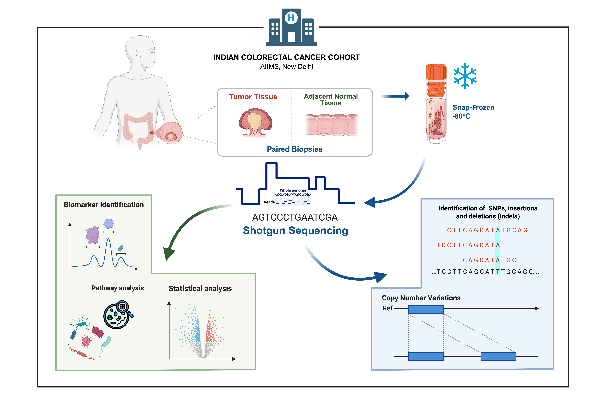

# A Proof-of-Concept Analytical Framework for Concurrent Microbial Profiling and Host Somatic Readout from Shotgun Biopsy Metagenomics in Colorectal Cancer

#### Study Design and Analysis Workflow
Our analysis workflow is organized into three major components:

1. Raw Read Quality Processing and Host Genome Alignment
Raw sequencing reads undergo quality control and preprocessing, followed by alignment against the human hg38 reference genome. Unaligned reads are extracted and used to reconstruct host-associated microbial sequences.
2. Microbial Metagenomic Profiling and Functional Analysis
The unaligned microbial reads are analyzed for taxonomic and functional composition, followed by microbial diversity assessment and metabolic pathway analysis to characterize the microbial community structure and functional potential.
3. Human Genomic Variant Identification
Reads aligned to the human genome are analyzed to identify high-confidence somatic nucleotide variants (SNVs) and copy number variations (CNVs) using established variant-calling and quality-filtering approaches.

This workflow provides an integrated framework for simultaneous characterization of host genomic alterations and microbial community profiles from sequencing data.

Here we've graphical overview of design of study and workflow

